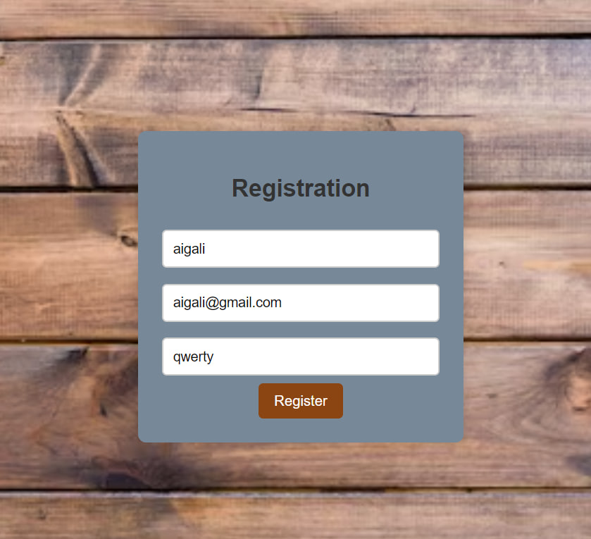

# Advanced Tech Shop

### General Information:
Welcome to the "Advanced Tech Shop," your go-to destination for high-quality IT devices, including laptops, PCs, and more. Our mission is to provide customers with a diverse selection of cutting-edge technology products to meet their specific needs and preferences.

### Key Features and Functions:

* **Product Catalog:** Advanced Tech Shop boasts an extensive product catalog featuring the latest models of laptops, complete with detailed specifications, features, and pricing information.

* **User-friendly Interface:** Our user-friendly interface ensures a seamless shopping experience. Customers can easily navigate through the product catalog, utilize filtering options, and find the perfect laptops that suit their requirements.

* **Secure Online Shopping:** We prioritize the security of your online transactions. Advanced Tech Shop employs secure payment gateways and encryption protocols, allowing customers to make purchases with confidence.

* **Order Tracking:** Keep tabs on your orders with our efficient order tracking functionality. From the moment you place your order to its delivery, we provide real-time updates on the status of your purchase.

* **Customer Support:** Our dedicated customer support team is ready to assist you with any inquiries or concerns. Whether through live chat, email support, or our hotline, we are committed to providing excellent customer service throughout your shopping journey.

* **Target Users:**
Advanced Tech Shop caters to a wide range of users, including individuals and businesses in need of laptops and related accessories. Our products are designed to meet the computing needs of students, professionals, freelancers, and anyone seeking reliable IT devices.

In essence, Advanced Tech Shop is committed to creating a convenient and trustworthy platform for purchasing laptops, offering a seamless online shopping experience for our diverse customer base.

### Installation Guide:
1. Install Golang: https://golang.org/dl/.
2. Run the server: `go run main.go`.
3. Utilize Postman or any HTTP client to send POST requests with JSON data to http://localhost:8080.

### Participants: 
* SE-2211
* Yessengali Makhanov
* Aigali Sultankul
* Batyrkhan Zhanabiliev
